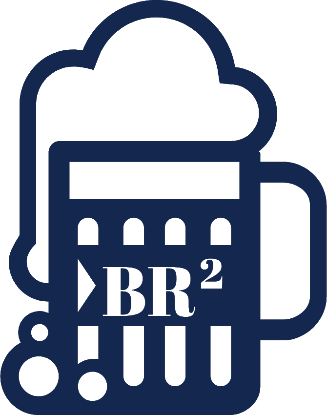

  

Lucky I am to have a job which is a passion too. I started my tech journey 20 years ago in hardware conception and then slowly slipped to software.

Do not ask me what is my domain predilection, I don't have one. I had worked in critical domaine like defense or nuclear. I also worked in realtime 3D for industry and digital communication.
I like challenges, people I met and my job.

And you already know this, I like BEER!!

 

<h2 align="center">🏗️ Personal productions 🏗️</h2>

 

  

    
    

      UE4 - Beats configurator
    

  

   

  

      
      
      
      
    

      Special Agency - MVP
    

  

<h2 align="center">🛠️ Stack 🛠️</h2>

  
    
    
    
    
    
    
     
  
    
    
    
    
    
  

  
    
    

  
    
  

 

<h2 align="center">🔥 GitHub Stats 🔥</h2>

  
  

